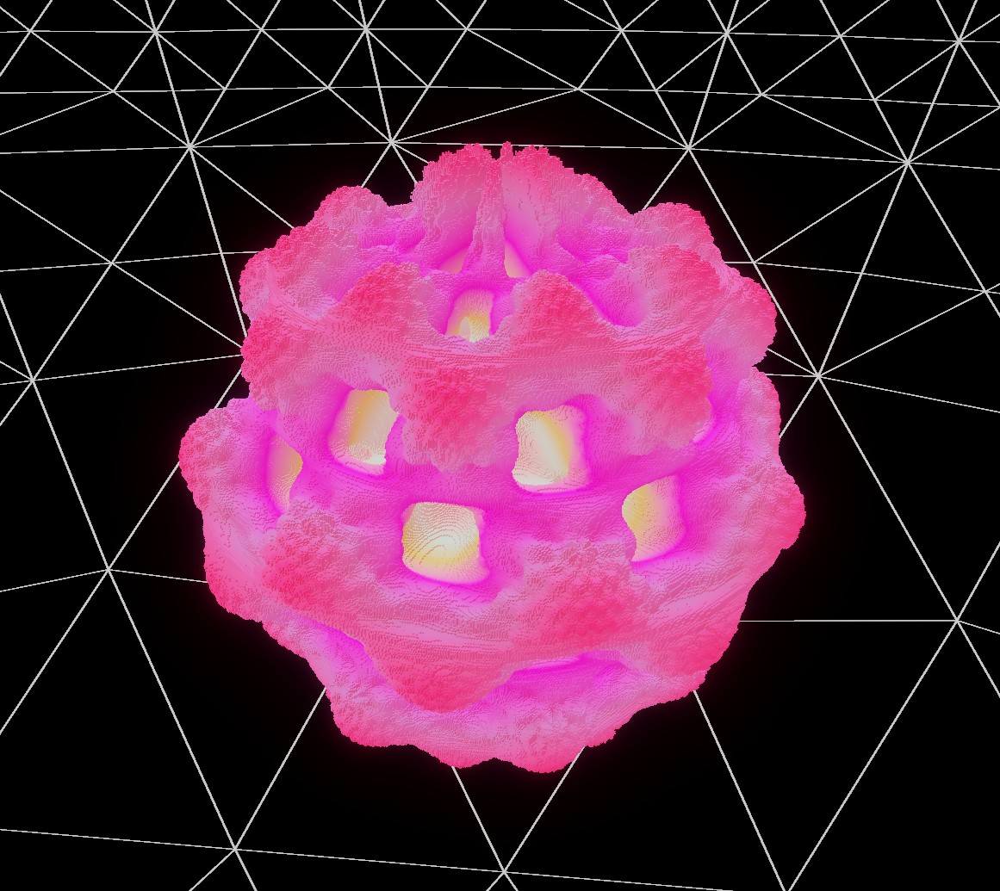
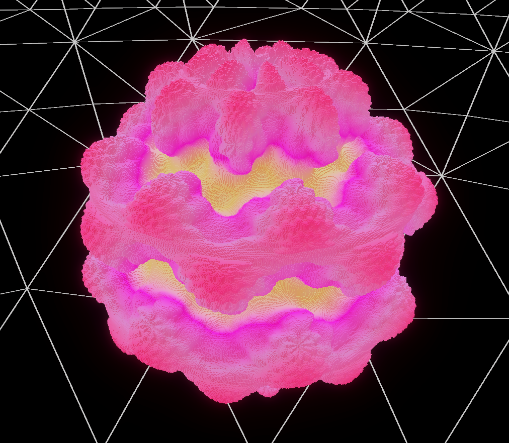
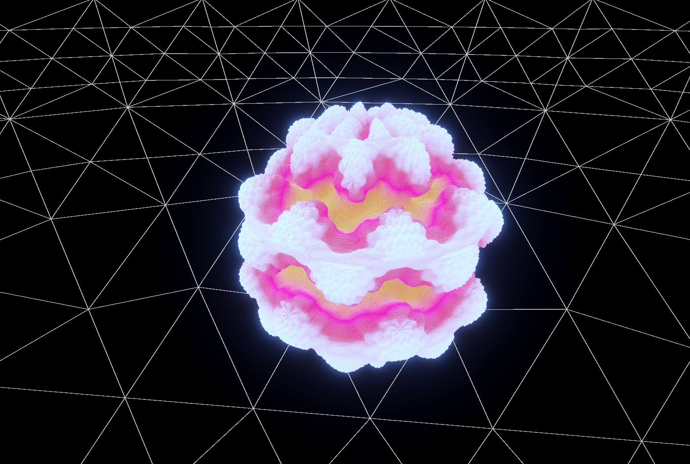

# Визуализатор фрактала Mandelbulb на Unity

Простой проект на Unity для визуализации фрактала Mandelbulb (3D-обобщение множества Мандельброта) с помощью кубических вокселей с использованием GPU-инстансирования.

## Скриншоты

### Использование

1. **Склонируйте или скачайте этот репозиторий.**
2. Откройте проект в Unity.
3. Создайте префаб для точки (например, сфера или куб с MeshFilter).
4. Присвойте этот префаб и любой материал в соответствующие поля компонента Plotter в инспекторе.
5. Отрегулируйте параметры (разрешение, количество итераций, порог и пр.) по своему вкусу.
6. Запустите сцену в режиме Play — Mandelbulb будет сгенерирован и отобразится автоматически.

### Основные параметры

- **dotPrefab**: Префаб точки, которая будет использоваться для визуализации
- **dotMaterial**: Материал точек
- **graphSize**: Размер графика
- **resolution**: Количество точек на одну ось (больше — детальнее и медленнее)
- **iterations**: Количество итераций при подсчёте принадлежности множества
- **threshold**: Пороговое значение — "радиус убегания" для множества
- **c**: Константа для расчёта фрактала (можете менять для разных форм)
- **batchSize**: Для скольки точек будет считаться принодлежность фракталу за один кадр.
- **renderBatchSize**: Пакет для RenderMeshInstanced

## Описание скрипта

Главный скрипт — `Plotter.cs`:
- Проходит по 3D-области и для каждой точки проверяет принадлежит ли она множеству Mandelbulb.
- Для точек, входящих во множество, собирается матрица трансформации для быстрого рендеринга.
- Используется `Graphics.RenderMeshInstanced` для высокопроизводительной отрисовки всех точек.

